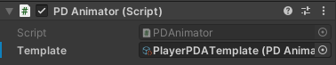
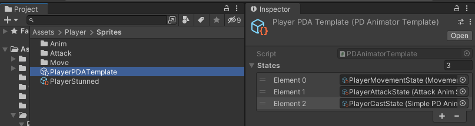
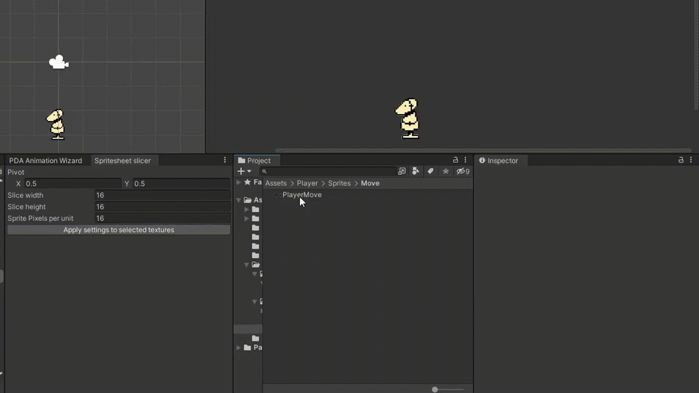
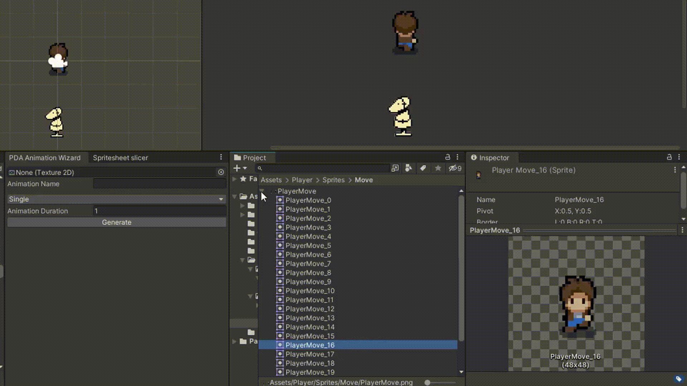

# Pixel-Directional-Animator
PDAnimator is a strange concoction of a rewritten Unity Animator that makes it simpler to use 2D-TopDown-Spritesheet animation (Think original Legend of Zelda), along with some tooling for convenience.

This project contains 3 separate units from a personal project:
- A custom Animator that replaces Unity's default one (PDAnimator)
- A tool that speeds up setup work for creating sprite sheets (Spritesheet Slicer)
- A tool that automates creating animations from a sprite sheet (PDA Animation Wizard)

<details>
<summary><h2>PDAnimator</h2></summary>

We've found that using the default Unity animator when working with a large amount of sprite sheet animation can be incredibly painful due to it's customizability coming at the cost of having to configure every bit of the animation.

To utilize this workflow, every animatable object should have a `PDAnimator` component:



Here, the template refers to a `PDAnimatorTemplate`, which is functionally similar to Unity's `AnimationController`. It holds information about the state machine and a list of all possible animation states this object can be in. Because it's a scriptable object, multiple objects in the world can share a reference to the same animation template.



### Animation states
Each animation state consists of a class defining the data for the state, and a class defining the behaviour of it.

Therefore, each animation state follows this structure:
```cs
public class XStateData : PDAnimatorStateData
{
	// Hold some serialized animation variables etc.
    public override PDAnimatorState ConstructState(PDAnimator animator)
    {
        return new XState(...);
    }
}

public class XState : PDAnimatorState
{
    new XStateData data;
	// Define some behaviour through overriden methods like `OnEnter()` etc.
}
```

The class inheriting from `PDAnimatorStateData` could hold a list of animation clips, and the class inheriting from `PDAnimatorState` could play one of the clips based on its' desired behaviour.

If all the behaviour needed for a state is "When this is entered, play this animation", we recommend using `SimplePDAnimatorState`. Create a Scriptable Object of this type (Create > PDA > Simple Animator State) and define the animation that should play.

If the state needs more complex behaviour, you can create your own pair of state classes. For this, you may utilize [this code template](https://gist.github.com/Akadeax/e4ffeccaf46c43f076736661d40fa3a6). For reference, see a real usage example of a custom PDAnimatorState [here](https://gist.github.com/Akadeax/6cb2791768a0754b037a9e6b2ec0fd98).

### Animation Clips
`PDAnimationClip`s are what actually holds data about the animations. They come in 2 flavors:
- `PDAnimationClip`, which holds the sprites in the animation along with meta data
- `PDAnimationClip4D`, which holds 4 separate `PDAnimationClip`s for each cardinal direction

The latter is useful for top-down games (Think original Legend of Zelda) due to having separate, yet related animations for all 4 cardinal directions (Walk Up, Walk Right, Walk Down, etc.); this bundles them together while also providing the method `GetAppropriate(Vector2)`. Depending on the input vector it returns the closest of the cardinal animations;
<br>
`(0, 1)` returns the Up Animation, `(-0.9, 0.1)` returns the Left Animation, etc.

This functionality is also used in [this example](https://gist.github.com/Akadeax/6cb2791768a0754b037a9e6b2ec0fd98) for choosing the correct movement animation based on player input.

This covers all basic features of PDAnimator, but for a complete in-context example of how you could structure your project's animations with and around PDAnimator see [a demo project here](https://github.com/Akadeax/skybourne-tower-combat/). This project relies on event-based components that inform PDAnimator states of needed animation changes during runtime while completely de-coupling all animation-related and gameplay-related code.

</details>

<details>
<summary><h2>Spritesheet Slicer</h2></summary>

This tool is a simple editor window. Using the built-in sprite slicer doesn't allow you to set parameters for the individual sprites (such as the pivot). This fixes that common issue.

Select any sprite sheets you want sliced in the file explorer (yes, this can be multiple), and run the slicer.



</details>

<details>
<summary><h2>Animation Wizard</h2></summary>

The Animation wizard allows you to select a spritesheet and instantly convert it into a `PDAnimationClip`. No manual assigning of individiual sprites needed.

the "Simple" mode creates a basic, 1-directional animation, while "Four Directional" generates animations for all 4 cardinal directions; it then creates a `PDAnimationClip4D` that contains these 4 animations, ready to be used by an Animator.

Our team utilized specifically this tool to great effect, as it shortens the process of "Create 5 scriptable objects, assign hundreds of frames manually & individually, hunt for wrong frames due to human error" into a single button press.



</details>
